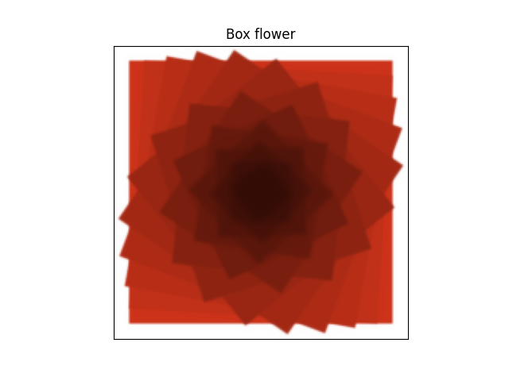
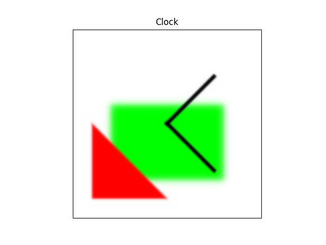
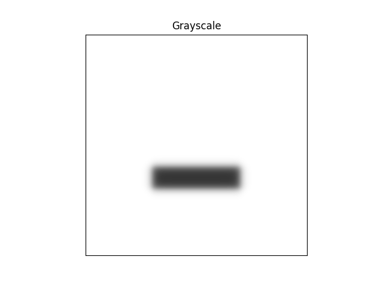

# ddrawdx

A small set of differentiable and jittable drawing primitives in JAX. A ```Canvas``` consists of a data array with pixel values and a mesh of evaluation points. This mesh can be translated, scaled and rotated. Any of the drawing functions evaluates a smooth function on the mesh to create a "mixing" matrix, and mixes pixels in the image with the color supplied. Currently all smooth transitions are sigmoid based. The sharpness of the transition is not scale invariant, i.e. if one zooms out and draws a shape using the same sharpness this will result in a sharper image

It is a bit janky.

[(Outdated) Function signature reference here.](https://vincentmolin.github.io/ddrawdx/src/ddrawdx/ddraw.html)

### Installation

```clone``` the repo and run ```pip install .``` in the root directory.

### Examples

https://github.com/vincentmolin/ddrawdx/blob/e7d075f5fcc3e7bfac12bf474c400b14ec08c4e1/example/example.py#L1-L19


https://github.com/vincentmolin/ddrawdx/blob/e7d075f5fcc3e7bfac12bf474c400b14ec08c4e1/example/example.py#L21-L34


https://github.com/vincentmolin/ddrawdx/blob/e7d075f5fcc3e7bfac12bf474c400b14ec08c4e1/example/example.py#L36-L40

