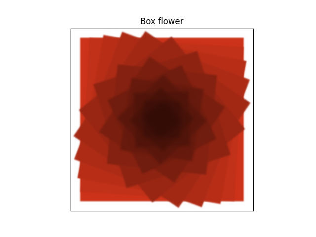
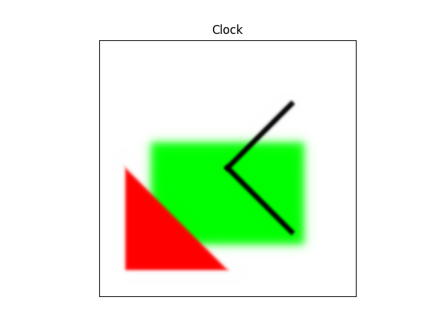
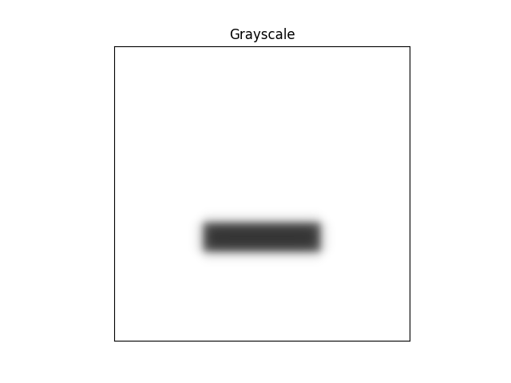

# ddrawdx

A small set of differentiable drawing primitives in JAX. A `Canvas` contains a
`(height, width, channels)` image and two coordinate meshes. Drawing functions
blend colors using sigmoid masks; mesh transformations translate, scale, and
rotate the coordinates used for subsequent drawing.

Functions have no internal JIT decorators. Apply `jax.jit` to the drawing sequence
you want to compile. Sharpness is measured in mesh coordinates, so scaling the
mesh changes the transition width in pixels.

[API reference](docs/src/ddrawdx/ddraw.md).

### Installation

Clone the repository and run `pip install .`, or use `uv pip install .`.

### Drawing and JIT

```python
import ddrawdx as drx
import jax

c = drx.canvas(320, 180, background=1.0)

def draw(c, center):
    c = drx.fill_circle(c, center[0], center[1], 0.2, drx.YELLOW)
    return drx.draw_line(c, 0.1, 0.1, 0.9, 0.8)

c = jax.jit(draw)(c, (0.5, 0.5))
fig, ax = drx.show(c)
```

Colors can be scalars, which apply to every channel, or vectors with one value
per channel. Default drawing colors are black in both RGB and grayscale.
Polygons may be concave and accept either vertex order. Arcs sweep clockwise in
radians and wrap modulo `2*pi`: equal angles are empty, while an explicit whole
turn draws a full circle. `fill_arc` fills the segment bounded by the arc and its
chord.

### Development

```sh
uv sync
uv run pytest
uv build
```

To build the documentation, run `uv run --group docs mkdocs build --strict`.
The package uses the `uv_build` backend.

### Examples

[Box flower](example/example.py)


[Clock](example/example.py)


[Grayscale](example/example.py)

